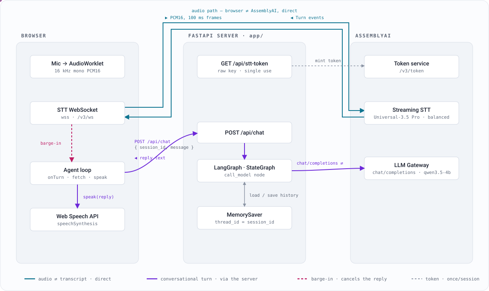

# AssemblyAI Realtime Voice Agent

A voice agent where **AssemblyAI does only realtime speech-to-text**, a **LangGraph**
agent handles the conversation, and the browser drives audio in/out. Bring-your-own
LLM (via LLM Gateway) and TTS.



**Two independent paths.** The FastAPI server only mints the one-time STT token and
handles conversational turns; the audio never passes through it. Turn-taking / VAD
comes from the STT stream (`SpeechStarted` + `Turn.end_of_turn`). Barge-in works only
because the two paths run independently — new speech can arrive while the LLM turn is
still in flight. The diagram animates when opened directly
([`docs/architecture.svg`](docs/architecture.svg)); an interactive version with the
"on the wire" detail is [here](https://claude.ai/code/artifact/bdef6c99-78b0-484b-8486-50ad6cb60874).

```
app/
  main.py              app assembly + static hosting (create_app)
  settings.py          env-driven configuration (Settings, get_settings)
  schemas.py           request models (ChatRequest: session_id + message)
  assemblyai.py        direct AssemblyAI calls: mint_stt_token()
  agent.py             LangGraph agent: StateGraph + checkpointer + ReAct tools, run_agent()
  tools.py             @tool functions (JSON-Schema) the agent can call
  api.py               HTTP routes: /api/config, /api/stt-token, /api/chat, /favicon.*
  static/
    index.html         UI
    app.js             STT WebSocket, orchestration loop, TTS, barge-in
    pcm-worklet.js     Float32 → 16 kHz mono PCM16 AudioWorklet
```

The backend is thin: `api.py` validates requests and delegates — token mints to
`assemblyai.py`, conversation turns to `agent.py`. The API key is read only in those
two modules; `settings.py` is the single source of config. There is **no inbound
WebSocket** — the browser opens the STT socket directly to AssemblyAI with the minted
token, so the server is plain request/response.

## Setup

```bash
python3 -m venv .venv
source .venv/bin/activate
pip install -r requirements.txt

cp .env.example .env      # then put your key in .env
# key (used for BOTH STT and LLM Gateway): https://www.assemblyai.com/dashboard/api-keys
```

## Run

```bash
uvicorn app.main:app --reload --port 8000
```

Open <http://localhost:8000>, click the mic, allow it, and talk. The agent replies out
loud; talk over it to interrupt. `localhost` is a secure origin so no HTTPS is needed
locally; to reach it from another device, use an HTTPS tunnel (ngrok / Cloudflare Tunnel).

## Tests

```bash
pip install -r requirements-dev.txt
pytest
```

`tests/` covers the backend — `settings` env parsing, `ChatRequest` validation,
`mint_stt_token` (mocked httpx: raw-key header, 502 mapping, missing-key 500),
`run_agent` (LangGraph stubbed: reply, `thread_id`, 429→`retry_after`, 502, 500), and
the routes via `TestClient` (`/api/config` shape, error-status mapping,
`/api/chat` forwarding + rate-limit body). Runs on every push/PR
([.github/workflows/test.yml](.github/workflows/test.yml)). No network or real key needed.

## Deploy

Container image + a GitHub Actions pipeline to **Azure Container Apps** (serverless
containers — scales to zero, HTTPS included). One-time OIDC / secret setup and all the
knobs are in **[DEPLOY.md](DEPLOY.md)**; after that, every push to `main` builds and
ships a revision. Local container check: `docker build -t voice-agent . && docker run
--rm -p 8000:8000 --env-file .env voice-agent`.

## How it works

| Piece | Where | Detail |
|---|---|---|
| STT token | `GET /api/stt-token` (server) | `GET https://streaming.assemblyai.com/v3/token?expires_in_seconds=60` — **raw key**, no `Bearer`. Single-use. |
| STT stream | browser | `wss://streaming.assemblyai.com/v3/ws?token=…&sample_rate=16000&speech_model=universal-3-5-pro&mode=balanced&format_turns=true&language_detection=true`. Mic → AudioWorklet → 16 kHz mono PCM16 → 100 ms binary frames. |
| Turn-taking | browser | `Turn` with `end_of_turn:false` → live partial; `end_of_turn:true` → final utterance → LLM. `SpeechStarted` drives barge-in. |
| Multilingual | — | Universal-3.5 Pro code-switches across 18 languages natively. The language selector defaults to **English** (pins `language_codes=en`); choose "Auto / multilingual" to unpin, or another language. `language_detection=true` shows the detected-language chip. |
| Agent | `POST /api/chat` (server) | LangGraph `StateGraph` → `ChatOpenAI` at `https://llm-gateway.assemblyai.com/v1` (**raw key**, OpenAI-compatible). Client sends only `{session_id, message}`; memory is a checkpointer keyed on `session_id`. On tool-capable models it's a ReAct loop over the JSON-Schema tools in `app/tools.py`. |
| TTS | browser | Web Speech API (`speechSynthesis`). Voice list is populated from the OS; `en-US` sorted first. No key, no network. |
| Barge-in | browser | `SpeechStarted` or a non-empty partial while the agent is busy → `speechSynthesis.cancel()` + `AbortController` on the `/api/chat` fetch. |
| Termination | browser | Sends `{"type":"Terminate"}` on Stop and `beforeunload`, then closes. |

### On the wire

| Segment | Payload | Cadence |
|---|---|---|
| Mic → Streaming STT | PCM16, 16 kHz mono, 100 ms binary frames | continuous while listening |
| Streaming STT → browser | `Turn` events — partials, then `end_of_turn` | ~3–4× per second |
| browser → `/api/chat` | `{ session_id, message }` | once per finished utterance |
| LangGraph ↔ LLM Gateway | OpenAI `chat/completions` + `MemorySaver` load/save | once per turn |
| LLM Gateway → browser | reply text → `speechSynthesis.speak()` | once per turn |
| Streaming STT → browser | `SpeechStarted` → cancel TTS + abort fetch | on interruption |
| `/api/stt-token` → AssemblyAI | mint single-use STT token | once per session |

### Agent (LangGraph)

`agent.py` builds a `StateGraph`. `run_agent(session_id, message)` invokes it with
`thread_id = session_id`, so the **server** keeps the running message history via a
`MemorySaver` checkpointer; the browser is stateless and sends one message per turn.

```
without tools:   START → call_model → END
with tools:      START → call_model ─┬─(tool call?)→ tools → call_model
                                     └─(else)──────→ END
```

- **JSON-Schema tool calling.** Tools live in [`app/tools.py`](app/tools.py) as `@tool`
  functions (`get_current_time`, `get_weather` — mock). `llm.bind_tools(TOOLS)`
  serializes each one to a JSON-Schema function definition in the OpenAI `tools`
  parameter; `ToolNode` + `tools_condition` run the ReAct loop. **The free model
  rejects a `tools` payload (HTTP 400)**, so tools default **off** for
  `qwen3.5-4b-32k-fast` and **on** for any other model. Force it with
  `LLM_ENABLE_TOOLS=true|false`. Add a tool = add a `@tool` function to `TOOLS`.
- **`MemorySaver` is in-process.** One instance is fine; a multi-instance deployment
  needs a shared checkpointer (`langgraph-checkpoint-postgres`/`-redis`) or sticky
  sessions. Relevant for the Azure step.
- System prompt: `SYSTEM_PROMPT` in `agent.py`.

### LLM model

`LLM_MODEL` in `.env`. This account currently only has access to **`qwen3.5-4b-32k-fast`**,
the free model.

> ⚠️ **Free-model rate limit: ~2 requests per 50 s** (`x-ratelimit-limit: 2`). That's
> ~1 conversational turn every 25 s — usable for a quick demo, not a fluent conversation.
> On a 429 the server returns immediately with `retry_after`; the UI shows the wait and
> drops that turn (it doesn't queue or hammer).

**The real fix** is enabling paid model access on the AssemblyAI account, then setting
`LLM_MODEL` to `claude-haiku-4-5-20251001` (cheap + fast, good for voice),
`gemini-2.5-flash`, `claude-sonnet-4-6`, etc. Model IDs are exact versioned strings — see
the [LLM Gateway overview](https://www.assemblyai.com/docs/llm-gateway/overview).
`GET https://llm-gateway.assemblyai.com/v1/models` lists IDs (existence, not entitlement).
To skip the Gateway entirely, point `LLM_BASE` at another OpenAI-compatible endpoint
(and its key) where `ChatOpenAI` is constructed in `agent.py`.

### Swapping TTS

Replace `speak()` / `stopSpeaking()` in `app.js`. For a cloud voice (ElevenLabs, Cartesia,
OpenAI), add a `POST /api/tts` route in `api.py` plus a helper in `assemblyai.py` (keeps
that key server-side too) that returns audio, and play it through an `AudioContext` —
mirror the barge-in `cancel()` path.

### Knobs

- STT: `STT_MODE` (`min_latency` / `balanced` / `max_accuracy`), `STT_SAMPLE_RATE` — env, parsed in `settings.py`.
- LLM: `LLM_MODEL`, `LLM_MAX_TOKENS` — env; graph and `SYSTEM_PROMPT` in `agent.py`.
- TTS: voice dropdown; `u.rate` in `app.js`.

## Verified

Against the live API on 2026-09-03: `/v3/token` mint, WS connect with the full param set
(`Begin` → clean `Termination`), 100 ms PCM16 framing accepted, and a LangGraph
round-trip through `/api/chat` on `qwen3.5-4b-32k-fast` — including cross-turn memory
(“what hobby did I mention?” answered from the checkpointer, client sending one message).
